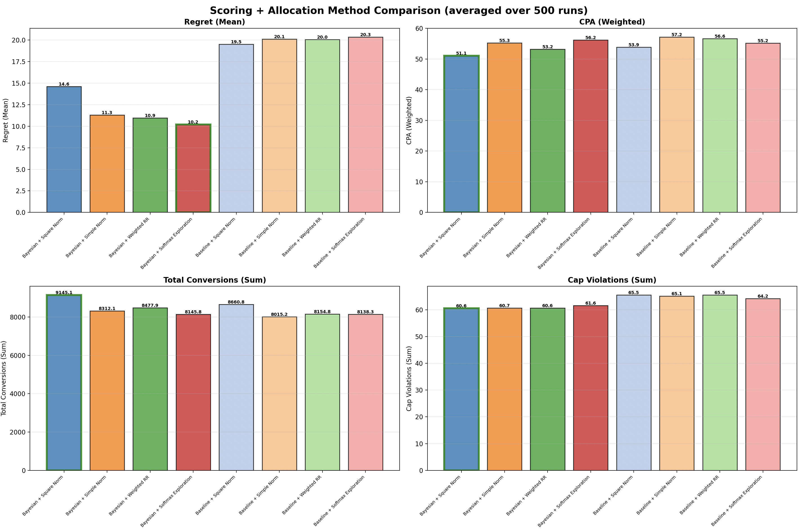
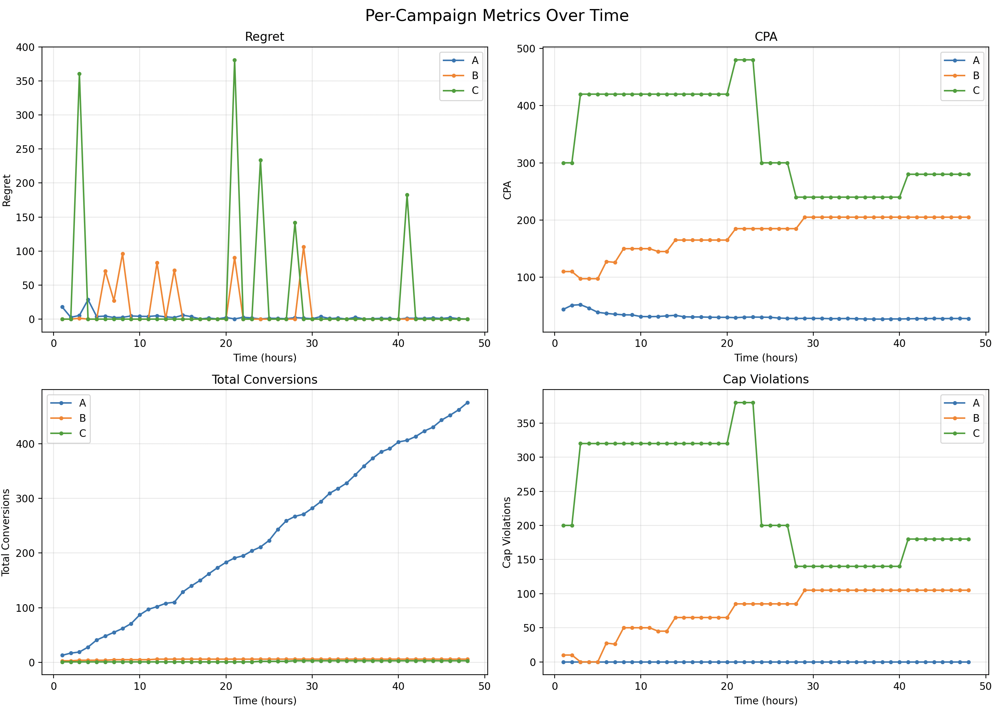
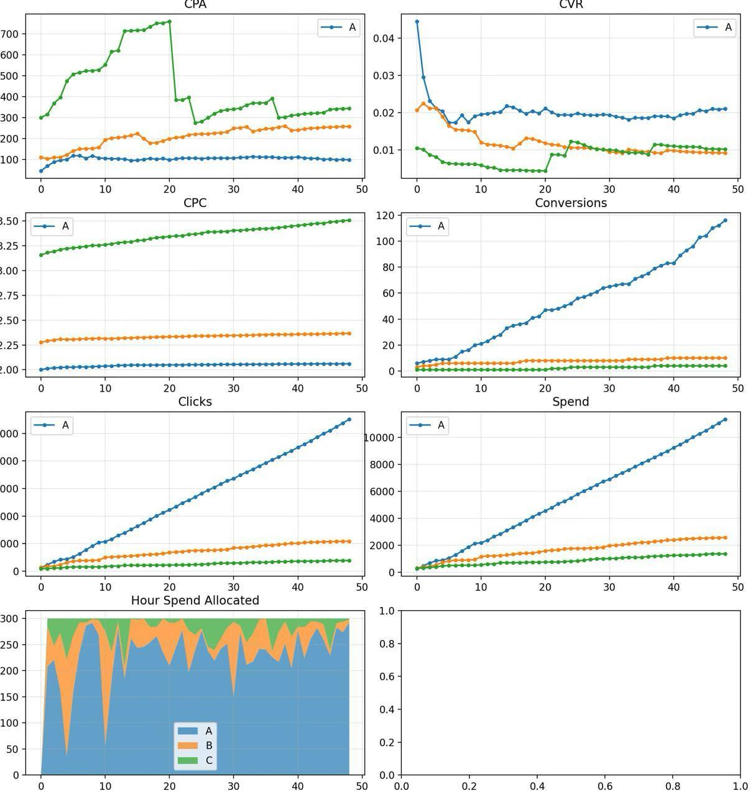
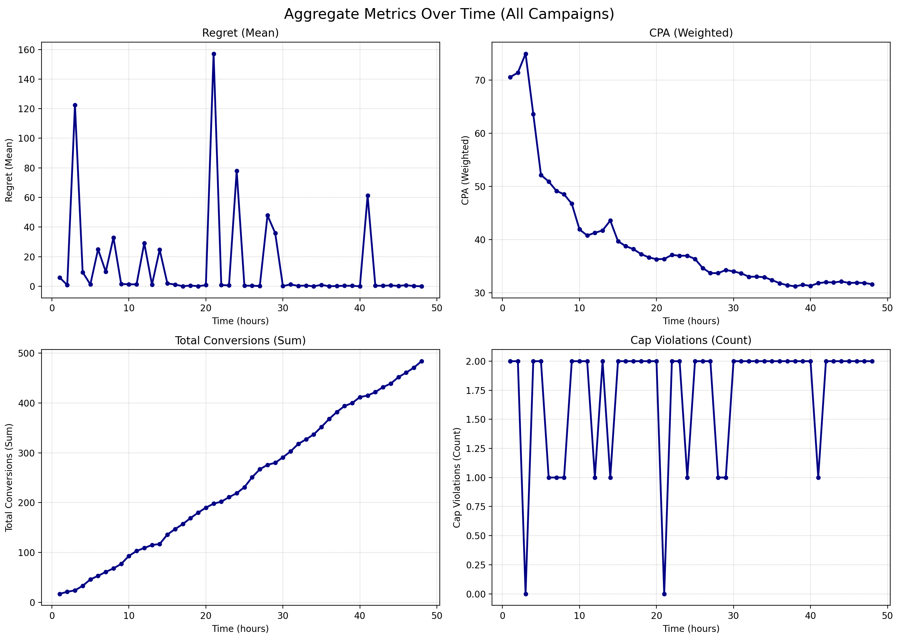

# Case Study – Benchmark of Allocation Algorithms

The purpose of this exercise is to **build a benchmark** to compare different scoring and budget allocation algorithms under controlled simulated conditions.

## Why

We aim to understand **which estimation and allocation strategies** yield the best results in ad performance.  
Although the full system involves many interacting variables (conversion variance per hour, CPC, cold start, caps, pacing, exploration), we’ll keep these **fixed** to focus only on the **allocator behavior**:

- **Score function:** how campaigns are ranked (e.g., Thompson Sampling vs. baseline CVR)
- **Allocation strategy:** how the hourly budget is distributed once scores are known (e.g., greedy, proportional, knapsack-like)

---

## What do we measure?

All campaigns belong to the same product, we want to maximize the sales with different strategies

## Metrics

| Metric | Description |
|--------|--------------|
| **Regret** | Lost conversions vs. optimal allocation |
| **CPA (Cost per Acquisition)** | Cost per conversion achieved |
| **Total conversions** | Overall campaign performance |
| **Cap violations** | Number of times avoid to invest |

**Others to explore (out of scope for now):**
- Volatility  
- Exploration share  
- Final profit  
- False positive cap violations
- Pacing error

---

## Simulation Design

To ensure reproducibility, we **separate campaign simulation from estimation**:

- **Empiric campaigns:**  
  Each campaign has an internal “true” conversion rate and CPC used to generate synthetic outcomes (clicks, conversions).
  
- **Estimator / allocator:**  
  Observes only simulated data and decides hourly spend for the next period.

To have enough samples on same algorithm we compare 1 vs N attems over the same algorithm and obtain the last metrics as mean

### Algorithms & Method

**Tested Combinations** (8 total = 2 scoring × 4 allocation):

**Scoring Methods**:
1. **Bayesian**: Samples CVR from Beta(α,β) distribution → derives CPA. Accounts for uncertainty.
2. **Baseline**: Samples CPA from Normal(μ, 0.5σ). Simple noise around historical CPA.

**Allocation Methods**:
1. **Square Normalization**: allocation ∝ score³ (aggressive - favors winners heavily)
2. **Simple Normalization**: allocation ∝ score (proportional distribution)
3. **Weighted Round Robin**: Iterative chunk allocation (ensures all get chances)
4. **Softmax Exploration**: Softmax on (score + exploration_bonus) (balances exploit/explore)

**Robustness**: Each combination runs **500 times** with different random seeds. Results are averaged to eliminate noise and ensure statistical validity. Each campaign HAS NOT A COMMON TRUE CPC/CVR that generates actual clicks/conversions. (required following steps)

**Simulation Setup**: The allocator only sees historical data and must estimate future performance.

# Results

## Algorithm Comparison (500 runs per combination)

Final benchmark comparing 2 scoring methods × 4 allocation methods across 500 independent runs each. Results show average performance metrics with best performers highlighted.

- Even with high regret, square norm gives more conversions. Probably due to budget distribution which is not measured (more research needed)

---

## Per-Campaign Metrics Over Time

---

## Single Campaign Example (Square Normalization)

---

# Limitations

- **The inner empiric campaign in real life can vary over time so results are highly dependant on the knowledge of how that works** 
- we assume conversions are immediate for the scope of this project
- Be careful with the beta and alfa, long running campaigns need to keep a window over the clicks / conversions 

- Primitive obsession: one of the problem of the solution delivered is that it passes a lot of unkown (list, float float) through parameters which reduces readability.
    - despite is better to have it sofly typed to ease usage of LLM
